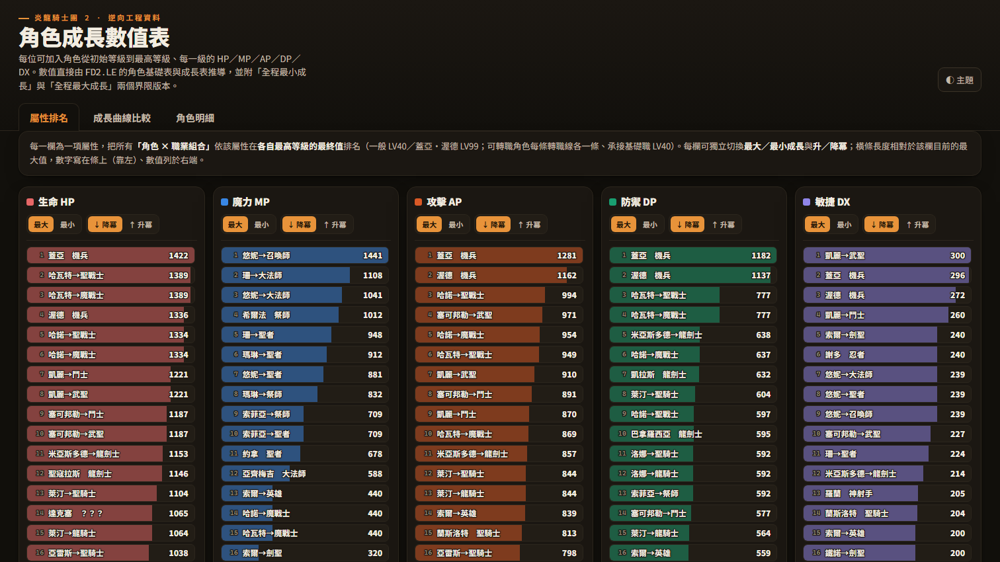

# 炎龍騎士團 2 逆向工程專案

這款遊戲不用多作介紹，是不少玩家(包含我自己)心目中的經典。

一直以來都對這款遊戲背後的運作機制感到好奇，想要了解其背後的原理，

最近 AI 大行其道，剛好想練習如何使用 AI 進行遊戲程式的逆向工程，

炎2看來就是最適合的選擇了。

感謝所有前輩對這款遊戲的研究心得，現在在 AI 的幫助下終於完成了這個目標。

這個專案從炎2遊戲執行檔中的機械指令碼還原出原始的 C 語言程式碼，

並且用當年的開發環境重新編譯出 fd2.exe，在 DOS 環境下直接取代原本的執行檔進行遊玩，100% 復刻原始執行檔的程式行為。

專案的目標是藉由原汁原味地復刻原始遊戲執行檔來分析並且理解遊戲的所有內容和每個面向，

感覺就像是把一台經典老爺車拆開來研究完每個零件以後再無損地組裝回去，享受過程的樂趣。

因此以遊戲體驗來說，這個專案的結果沒有新的東西，因為一樣都是在 DOS 環境 (DOSBox, 86Box 模擬器或是 DOS 實機) 裡面玩原本的遊戲內容。

---

## 如何編譯

`src/` 底下就是從原始執行檔還原出來的完整 C 原始碼，用當年的開發環境就能重新編譯出跟原版行為一模一樣的 `FD2.EXE`。

### 需要的工具

| 工具                        | 說明                                                                                                                                                                                                                           |
| --------------------------- | ------------------------------------------------------------------------------------------------------------------------------------------------------------------------------------------------------------------------------ |
| **Watcom C/C++ 9.5a** | 當年開發炎2用的編譯器，可以在 Internet Archive 上找到。版本必須完全相同才能忠實重建(細節見`rebuild_info/crt/fid_match.md`)。安裝後把環境變數 `%WATCOM%` 指向安裝目錄，或直接放在 `%USERPROFILE%\Documents\WATCOM_9.5a`。 |
| **DOSBox-X**          | Watcom 9.5a 是 DOS 時代的工具，透過 DOSBox-X 來跑。記得加入系統`PATH`。                                                                                                                                                      |
| **Python 3**          | 用來執行建置腳本。                                                                                                                                                                                                             |

### 指令

在 repo 根目錄執行：

```bash
python tools/fd2_build/build_fd2.py
```

腳本會在 DOSBox-X 裡用 Watcom 編譯 `src/` 下的所有原始碼並連結，產出：

```
workspace/fd2_build/exe/out/FD2.EXE
```

之後把這個 `FD2.EXE` 覆蓋掉遊戲目錄裡的原檔，就能在 DOSBox-X / 86Box / DOS 實機上照常遊玩(編譯本身不需要遊戲資料檔)。

95 版的 fd2.exe 有包入 dos4gw.exe，98版則沒有，分開成兩個檔案放置。

這個專案是以 98 版為對象還原，如果要放到 95 版的遊戲資料夾內執行，也必須複製 dos4gw.exe  過去。

本 repo 不包含原始遊戲檔案。

---

## 各人物屬性數值比較表

把每個角色升級時的屬性成長數值全部解出來，整理成一頁可以互動查看、對照的比較表：

[](https://fdpsfred.github.io/fd2-anatomy/character-stat-comparison/fd2_growth_tables.html)

👉 **[點我開啟互動版：角色成長數值表](https://fdpsfred.github.io/fd2-anatomy/character-stat-comparison/fd2_growth_tables.html)**

(這頁由 `tools/growth_table/` 從遊戲資料自動產生。)

---

## 有趣的發現

### 找到沒有被用到的對話資料

遊戲第 1~6 章的戰鬥對白裡，各藏著一頁**永遠不會出現在遊戲中**的孤兒台詞——把程式碼所有會叫出對話的路徑都追過一遍，確定沒有任何地方會顯示這幾頁。

內容還是主角索爾的無厘頭獨白，兩句輪流出現：「奈野啊捏？」和「這‥‥這是什麼碗糕！」。

> 詳見 `resource_info/fdtxt.md`

### 95 年初版和 98 年合輯版的差異

炎2發行過 1995 初版和 1998 合輯版兩個版本。把兩版的資源檔逐一比對後發現，整套遊戲資料**其實只有三個檔案真的不一樣**：

- **5 個法術改了名字**：`咒殺 → 咒殺術`，另外四個從功能描述式改成比較帥氣的稱呼——`攻擊術 → 魔刃術`、`防禦術 → 魔鎧術`、`速度術 → 風行術`、`施毒術 → 毒擊術`。
- **中文字模圖集重新編號**：字其實沒變，只是換了編號，卻連帶讓文字檔多出約兩成的位元組差異——一度看起來像大改，實際上一個字都沒動。
- **主角索爾的英雄職戰鬥動畫換版**：初版腳下有個橢圓台座，合輯版把它拿掉了。


*上排為 95 初版(腳下有紅褐色橢圓台座)，下排為 98 合輯版(台座已移除)。*

> 詳見 `resource_info/version_diff.md`

📚 想更深入了解遊戲的每個系統、資源檔格式、逐章劇情與數值，可以從知識庫索引 [`index.md`](index.md) 開始逛。
