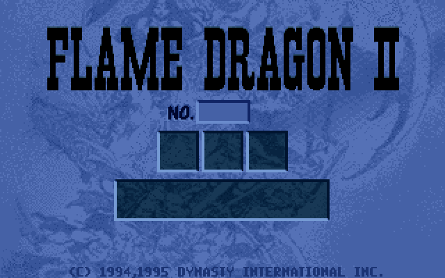
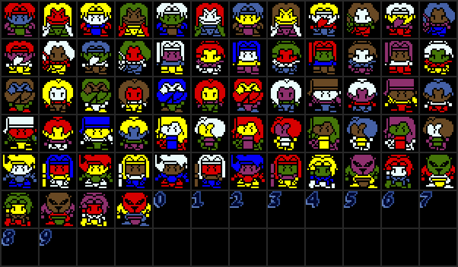

# FDOTHER.DAT — UI / portrait / SFX / cinematic 雜項資源

內容最雜的資源檔（第三大，排在 FIGANI.DAT 15,279,582 與 FDSHAP.DAT 3,557,794 之後）。
outer 103 entries 內含 29 個 nested LLLLLL sub-archive；可定址資源約 250
（74 個 leaf outer + 176 個 sub-entry）。
file size 3,382,481 bytes，103 outer entries (idx 0..102) + 176 sub-entries。

## 檔案格式

LLLLLL archive (outer)。29 個 outer entries 自身又是 LLLLLL sub-archive，
sub-entries 各自獨立索引。

## 啟動載入靜態 (main 序列)

`main @ 0x25BF4` 啟動時載入 7 個 FDOTHER + 1 個 FDTXT entry（載入順序 0x1F 最先，
其後 idx 1..6；FDTXT idx 0）：

| idx | 全域變數 | 用途 | 大小 |
|---|---|---|---|
| 0x01 | `data_fd2_cursor_highlight_sprite_sheet_ptr @ 0x53A4D` | battle tile sprite table | 2,235 |
| 0x02 | `data_fd2_menu_dialog_box_sprite_sheet_ptr @ 0x53A89` | menu dialog state | 37,680 |
| 0x03 | `data_fd2_tile_anim_table_base @ 0x53A6D` | tile 動畫表 (LMI1 magic) | 5,990 |
| **0x04** | `data_fd2_chinese_font_sheet @ 0x53A75` | **1bpp 中文字模 (1824 glyphs × 32 bytes)** | 58,368 |
| 0x05 | `data_fd2_ui_anim_sprite_sheet_ptr @ 0x53A81` | UI / 動畫 sprite sheet (LMI1 magic) | 44,181 |
| **0x06** | `data_fd2_resource_portrait_sheet_ptr @ 0x53AD1` | portrait sheet (LMI1 magic) | 33,415 |
| **0x1F** | `data_fd2_audio_fdother_sfx_bank_buf_ptr @ 0x53EEC` | UI/menu SFX bank (nested archive 13 sub-entries，全為 8-bit PCM 樣本) | 31,771 |

`data_fd2_chinese_font_sheet` 是 **1bpp** (58368 ÷ 1824 ÷ 32 = 1.0)。
`fd2_blit_glyph_1bpp_with_outline @ 0x4EA2A` 的「1bpp」指 **input glyph**（每字
32 bytes = 16 列 × 2 byte）;輸出是 8bpp mode-13h（每像素一個 palette-index byte）——
每個 set bit 寫一個 fill_color byte，並在其左下、正下各寫一個 outline_color byte 作
drop-shadow。

## 章節載入靜態 (chapter_id-dispatched)

| idx | caller | 用途 |
|---|---|---|
| 0x09 | `fd2_animate_party_addition_with_appear_effect` | 角色加入動畫 |
| 0x0A | `fd2_chapter_transition_menu` | chapter_transition_menu_panel_buffer |
| 0x0D | `fd2_chapter_transition_menu` / `fd2_main_menu_dispatcher` / `fd2_run_chapter_intro_menu_typeB` | chapter intro sprite atlas |
| 0x0E | `fd2_run_chapter_intro_menu_typeC` | chapter intro typeC sprites |
| 0x22 | `fd2_play_chapter_21_hidden_stage_unlock_cinematic` | chapter intro slideshow |
| 0x2A | `fd2_load_chapter_background_layers` | chapter background |
| 0x2D | `fd2_chapter_event_handler_3d__ch26_pickup` | ch26 pickup 動畫 |
| 0x4F | `fd2_play_game_over_sequence` | game over screen (2-frame) |
| 0x58 | `fd2_chapter_25_init` | earthquake_sfx (nested archive 2 sub-entries) |

## Cinematic / Ending 序列靜態

| idx | caller | 用途 |
|---|---|---|
| 0x07 | `fd2_title_attract_and_main_menu` | nested archive 7 sub-entries — ending sprite group |
| 0x08 | `fd2_title_attract_and_main_menu` | ending sprite group |
| 0x36 | `fd2_play_game_ending_cinematic` | 263 KB RLE 320×200 cinematic image |
| 0x38 | `fd2_play_final_chapter_30_ending` | final chapter 30 ending image |
| 0x39, 0x3A, 0x3B, 0x3C | `fd2_play_game_ending_cinematic` | game ending cinematic 4 連續 idx |
| 0x4A, 0x4C | `fd2_title_attract_and_main_menu` | ending sequence images |
| 0x4D | `fd2_title_attract_and_main_menu` | ending 序列 SFX bank (nested archive 4 sub-entries，全為 PCM 樣本；`sfx_bank`) |
| 0x4E | `fd2_play_ani_file_animation_sequence` | nested archive 1 sub-entry — ANI 配套 SFX |
| 0x63 | `fd2_title_attract_and_main_menu` | ending text/banner image |
| **0x65** | `fd2_title_attract_and_main_menu` (×3) + `fd2_display_cinematic_image_with_fade` (×1) | VGA palette (768 bytes = 256 × 3 RGB DAC) |
| 0x66 | `fd2_title_attract_and_main_menu` | ending image |

## SFX / Animation 群組靜態

| idx | caller | 用途 |
|---|---|---|
| 0x40 | `fd2_maybe_load_speed_mode_sfx_bank` | nested archive 6 sub-entries — speed-mode attack-hit SFX bank |
| 0x50 | `fd2_load_status_effect_sfx` | nested archive 16 sub-entries — status effect SFX bank |
| 0x51 | `fd2_animate_warp_teleport_char` | nested archive 2 sub-entries — warp teleport 動畫 |
| 0x5F | `fd2_animate_party_addition_with_appear_effect` | nested archive 1 sub-entry |

## Dynamic-domain 公式

### chapter-id-dispatched (`fd2_load_chapter_background_layers @ 0x10652`)

`fd2_load_chapter_background_layers` 依 `current_chapter_id` 分三型載入 FDOTHER
背景圖層 (single-sprite / widescreen 上下雙圖 / text-scroll 過場)。widescreen 型
以 `idx_base` 與 `idx_base + 1` 各載上下半：

| current_chapter_id | FDOTHER idx | 型態 (bg_width × bg_height) |
|---|---|---|
| 9 / 0x18 / 0x19 | 0x0F | single-sprite (0x1CE × 0xE2) |
| 0x11 | 0x10 + 0x11 | widescreen 上下雙圖 (0x1CE × 0xE2) |
| 0x15 | 0x23 + 0x24 | widescreen (0x198 × 0x114) |
| 0x16 | 0x28 + 0x29 | widescreen (0x198 × 0x100) |
| 0x1B | 0x2E + 0x2F | widescreen (0x1CE × 0xF4) |
| 0x17 | 0x2A | text-scroll 過場 (0x138 × 0xC0 = 312 × 192) |
| 0x1C / 0x1D | 0x37 | single-sprite |
| 其他 (default) | 0x10 | single-sprite (0x1CE × 0xE2) |

### spell_id derived (`fd2_execute_summon_spell_cast`)

`fd2_load_dat_resource(... "FDOTHER.DAT", NULL, spell_id + 0x21)` 對 summon spells
spell_id ∈ {0x20, 0x21, 0x22, 0x23} → FDOTHER idx **0x41 / 0x42 / 0x43 / 0x44**。

### ending scroll-panel loop (`fd2_title_attract_and_main_menu`)

ending 序列 loop `for(i=0..4) load("FDOTHER", i+0x45)` → FDOTHER idx **0x45..0x49**
(5 entries，rle_blit 逐段疊成垂直捲動 credit panel)。0x4A/0x4B/0x4C/0x4D 由各自獨立
單次載入（title sprite / cinematic image / title palette / ending SFX bank），非此 loop。

## Table/LUT-driven idx（immediate-search 掃不到）

dead 判定不能只掃「callsite 50 instruction 內的 immediate」——那會漏掉用查表分派的
載入。共有 6 張 idx 表把 FDOTHER entry index 餵給 `fd2_load_dat_resource`：3 張全域表，
外加施法 cinematic `fd2_play_spell_cast_sequence @ 0x2A6BD` 內的 3 張 function-local `const`
表（原版由 .rodata 拷到 stack 後 byte-index），表內 idx 皆 live：

| 表 | 內容 idx | dispatcher | 索引方式 / 用途 |
|---|---|---|---|
| `data_fd2_chapter_intro_panel_resource_idx_per_metadata_category_table @ 0x526D7` | 0x0B / 0x3D / 0x3E | `fd2_chapter_transition_menu @ 0x2CAD7` | `table[bCategory]`（0/1/2）story 章 intro panel |
| `data_fd2_battle_summon_spell_sfx_bank_index_table @ 0x5255B` | 0x5B / 0x5C / 0x5D / 0x5E | `fd2_execute_summon_spell_cast @ 0x27FC9` | `table[spell_id-0x20]`（spell 0x20..0x23）召喚系 SFX bank |
| `data_fd2_audio_figani_sfx_bank_fdother_index_lut @ 0x525D6` | 0x30..0x35 | `fd2_load_figani_sfx_bank @ 0x2BC9A`（3 caller）| `lut[sfx_id_byte-1]` FIGANI 動畫 SFX bank |
| `intro_sfx_bank[10]`（function-local） | 0x52..0x5A | `fd2_play_spell_cast_sequence @ 0x2A6BD` | `table[spell_id]`（spell 0..9）施法前奏 SFX bank |
| `player_team_sprite_id[9]`（function-local） | 含 0x12/0x13/0x1A/0x27/0x16/0x18/0x20/**0x25**/0x1C | 同上（`caster->team != 0`） | `table[spell_id]` 我方施法者底座 sprite |
| `enemy_team_sprite_id[10]`（function-local） | 含 0x14/0x15/0x1B/**0x2B**/0x17/0x19/0x21/**0x26**/0x1E/**0x2C** | 同上（`caster->team == 0`） | `table[spell_id]` 敵方施法者底座 sprite |

過去因只做 immediate-search 而被誤判為 dead、實為 table-driven live 的 idx 共 17 個：
先前經 3 張全域表回收 8 個（0x3D / 0x3E / 0x5B / 0x5D / 0x31 / 0x33 / 0x34 / 0x35），
再經上述 3 張 function-local 表回收 9 個（0x25 / 0x26 / 0x2B / 0x2C / 0x52 / 0x53 / 0x55 / 0x56 / 0x57）。

## Dead idx：3 個真 dead（另 9 個曾誤判、已回收）

以 `src/` 全檔窮舉每一個 `fd2_load_dat_resource(FDOTHER, …)` 載入點（61 處）+ 每一張餵
FDOTHER index 的表（3 張全域 dispatch 表 + 施法 cinematic 的 function-local 表），取代舊的
binary immediate-search（掃「callsite 50 指令內 immediate」+ 排除 3 張全域表）。結論：**只有
3 個 idx 真的無任何載入路徑**。舊 KB 的「12 confirmed dead」其中 9 個是誤判——它們由
`fd2_play_spell_cast_sequence @ 0x2A6BD`（基礎攻擊法術 cinematic）以 `table[spell_id]` 載入，
表是函數內的 `const` 陣列（原版由 .rodata REP MOVSD 拷到 stack 後 byte-index），既非 literal
也不在 3 張全域表內，故 immediate-search 掃不到（與當初漏掉 8 個 table/LUT-driven idx 同一類問題）。

真正 dead 的 3 個（全 src 載入點 + 全表值 + 全算式定義域皆不含此 idx；工具
`tools/rsrc_unresolved/verify_dead.py`）：

| idx | size | dead payload 內容（實檔解碼 + PNG 檢視） |
|---|---|---|
| 0x60 | 24,156 | 24×24 sheet（84 格；沿用 FDSHAP tile-sheet header 格式，但內容是約 64 個角色小頭像 + 0-9 數字字模，非地形 tile） |
| 0x61 | 39,358 | 320×200 全螢幕圖：未用的英文標題/選擇畫面「FLAME DRAGON II」，(C) 1994,1995 Dynasty International，含「NO.」數字欄與空槽面板 |
| 0x62 | 3,273 | 155×30 橫幅：未用的「密碼輸入錯誤 !!!」錯誤訊息（被移除的密碼／防拷機制） |

判定：cut content，且三者是**同一個被移除的早期英文前端**——英文標題（0x61）→ 密碼防拷（0x62 錯誤橫幅）→ 以數字（0x60 字模）＋角色小頭像（0x60）呈現的存檔／角色選擇畫面。皆合法資源、binary 零引用，非隨機殘料。

三者解碼後的實圖如下（以 FDOTHER[0] base VGA palette 上色，故整體偏藍、非原版設計配色，但結構與文字清楚；重繪見 `tools/rsrc_unresolved/verify_dead.py` 同目錄的解碼工具）：

**0x61** — 未用英文標題/選擇畫面「FLAME DRAGON II」（(C) 1994,1995 Dynasty International）：

**0x60** — 24×24 sheet：約 64 個角色小頭像 + 0-9 數字字模：

**0x62** — 未用「密碼輸入錯誤 !!!」橫幅：

被回收的 9 個（原誤判 dead，實為 live；載入者 `fd2_play_spell_cast_sequence` 的 spell-index 表）：

| idx | 載入表[slot] | 用途 |
|---|---|---|
| 0x25 | `player_team_sprite_id[7]` | 我方施法者底座 sprite（spell 7） |
| 0x26 | `enemy_team_sprite_id[7]` | 敵方施法者底座 sprite（spell 7） |
| 0x2B | `enemy_team_sprite_id[3]` | 敵方施法者底座 sprite（spell 3） |
| 0x2C | `enemy_team_sprite_id[9]` | 敵方施法者底座 sprite（spell 9） |
| 0x52 | `intro_sfx_bank[0/1]` | 施法前奏 SFX bank（spell 0/1） |
| 0x53 | `intro_sfx_bank[2]` | 施法前奏 SFX bank（spell 2） |
| 0x55 | `intro_sfx_bank[4]` | 施法前奏 SFX bank（spell 4） |
| 0x56 | `intro_sfx_bank[5]` | 施法前奏 SFX bank（spell 5） |
| 0x57 | `intro_sfx_bank[6]` | 施法前奏 SFX bank（spell 6） |

## 完整分類

| 分類 | 計數 |
|---|---|
| documented_static | 38 |
| documented_dynamic_recovered_via_binary_immediate_search | 33 |
| documented_dynamic_domain (formula explicit) | 12 |
| documented_dynamic_table_indexed (全域 8 + spell-cinematic function-local 9，皆前誤判 dead) | 17 |
| confirmed_dead (src 全載入點窮舉，真 no-ref) | 3 |
| **TOTAL** | **103** |

## 29 個 nested sub-archive

29 個 nested archive 合計 176 個 sub-entry，內容經實檔逐一解碼分兩類：

- **sprite 群組（3 個 archive、65 sprite）**：0x07（7）、0x0C（28）、0x3F（30），
  sub-entry 皆 RLE 4-op sprite（自帶 `[w][h]` header，見 `codecs.md` §A）。0x0C 與
  0x3F 是近乎重複的 chapter-intro sprite atlas 變體（前 23 個 sub-sprite 尺寸完全相同，
  含 1 張 320×200 全景）。
- **PCM 音訊 bank（26 個 archive、111 樣本）**：其餘全部，sub-entry 皆 8-bit unsigned
  PCM 樣本（靜音值 0x80）；即各系 SFX bank（UI/menu、figani、status-effect、summon、
  warp、speed-mode、ending、ANI chime、施法前奏 spell-intro 0x52-0x5A 等）。播放端
  `fd2_play_sfx_with_handle` /
  `fd2_play_sfx_sample_from_bank` 以 `base + 6 + id×4` 的 u32 offset 表取樣本位址
  （即 sub-archive 的 LLLLLL offset 表），`AIL_set_sample_address(base + off, len)`。

sub-entry 本身仍走 LLLLLL 容器格式（sig + u32 offset 表），與 outer 相同。

| outer idx | size (bytes) | sub-entries | 用途 |
|---|---|---|---|
| 0x07 | 23377 | 7 | ending sprite (`fd2_title_attract_and_main_menu`) |
| 0x0C | 51759 | 28 | chapter-intro sprite atlas（RLE sprite） |
| 0x1F | 31771 | 13 | UI/menu SFX bank，PCM (`main` 啟動) |
| 0x30 | 24183 | 6 | figani SFX bank (LUT @0x525D6) |
| 0x31 | 27871 | 7 | figani SFX bank (LUT @0x525D6) |
| 0x32 | 31429 | 5 | figani SFX bank (LUT @0x525D6) |
| 0x33 | 28106 | 5 | figani SFX bank (LUT @0x525D6) |
| 0x34 | 26164 | 6 | figani SFX bank (LUT @0x525D6) |
| 0x35 | 19394 | 4 | figani SFX bank (LUT @0x525D6) |
| 0x3F | 60972 | 30 | chapter-intro sprite atlas（RLE sprite，0x0C 近重複變體） |
| 0x40 | 18791 | 6 | speed_mode_overlay |
| 0x4D | 52031 | 4 | ending 序列 SFX bank，PCM |
| 0x4E | 6492 | 1 | ANI 配套 |
| 0x50 | 116165 | 16 | status_effect_sfx |
| 0x51 | 18710 | 2 | warp_teleport |
| 0x52 | 20003 | 2 | 施法前奏 SFX bank，PCM (`intro_sfx_bank[0/1]`, spell 0/1) |
| 0x53 | 33848 | 4 | 施法前奏 SFX bank，PCM (`intro_sfx_bank[2]`, spell 2) |
| 0x54 | 24389 | 3 | 施法前奏 SFX bank，PCM (`intro_sfx_bank[3]`, spell 3) |
| 0x55 | 13959 | 2 | 施法前奏 SFX bank，PCM (`intro_sfx_bank[4]`, spell 4) |
| 0x56 | 11670 | 2 | 施法前奏 SFX bank，PCM (`intro_sfx_bank[5]`, spell 5) |
| 0x57 | 20143 | 4 | 施法前奏 SFX bank，PCM (`intro_sfx_bank[6]`, spell 6) |
| 0x58 | 14953 | 2 | chapter_25_init earthquake_sfx；亦 `intro_sfx_bank[7]` (spell 7) |
| 0x59 | 15308 | 3 | 施法前奏 SFX bank，PCM (`intro_sfx_bank[8]`, spell 8) |
| 0x5A | 26591 | 3 | 施法前奏 SFX bank，PCM (`intro_sfx_bank[9]`, spell 9) |
| 0x5B | 33581 | 3 | summon SFX bank (table @0x5255B, spell 0x20) |
| 0x5C | 20247 | 2 | summon SFX bank (table @0x5255B, spell 0x21) |
| 0x5D | 20247 | 2 | summon SFX bank (table @0x5255B, spell 0x22) |
| 0x5E | 33581 | 3 | summon SFX bank (table @0x5255B, spell 0x23) |
| 0x5F | 10458 | 1 | fd2_animate_party_addition_with_appear_effect |

## 工具

- archive header / nested sub-archive 拆解：`tools/decoders/dat_header_parser.py`
- sprite / cinematic image 解碼：`tools/decoders/rle_decoder.py` (RLE 4-op，編碼見
  `resource_info/codecs.md`)
