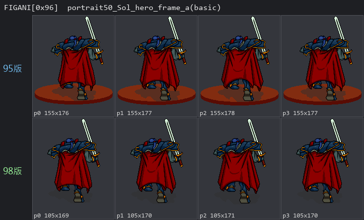
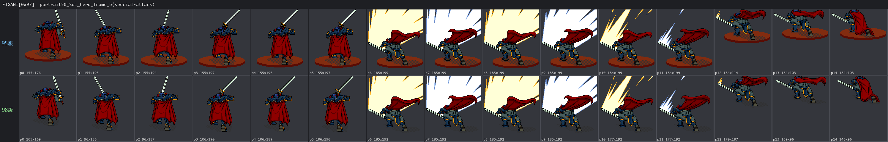
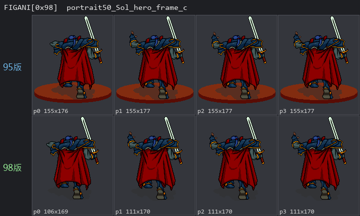
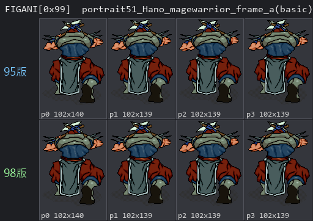

# 95 初版 vs 98 合輯版 資源檔差異

炎龍騎士團二代發行過兩個版本:**1995 初版**(原始單機發行)與 **1998 合輯版**
(「炎龍騎士團合輯版」內收錄的二代,也是本專案的逆向對象,即 `fd2_game_files/`)。
就遊戲資源檔而言,兩版之間只有 **三個檔案** 內容不同:`FDTXT.DAT`、`FDOTHER.DAT`、
`FIGANI.DAT`;其餘資源檔(FDFIELD / FDSHAP / DATO / ANI / BG / TAI / FDMUS / FDICON /
TITLE 等)兩版逐位元組完全相同。

這三處差異彼此相關,可歸納成三件實際改動:

1. **5 個法術改名**(FDTXT.DAT)。
2. **中文字模圖集 重新編號**(FDOTHER.DAT[4])——這也連帶造成 FDTXT.DAT 大量位元組差異。
3. **主角索爾英雄職戰鬥動畫換版**(FIGANI.DAT)——95 初版腳下有橢圓台座,98 合輯版移除。

命名風格上,95 初版的法術名走**功能描述式**(攻擊術 / 防禦術 / 速度術 / 施毒術),
98 合輯版改成**修飾式**(魔刃術 / 魔鎧術 / 風行術 / 毒擊術)。

## FDTXT.DAT — 5 個法術改名

兩版 `FDTXT.DAT` 同為 120,502 bytes。位元組層級雖有約 24,000 bytes(~20%)不同,但那
**絕大多數只是字模重新編號造成的編碼差異**(見下節 FDOTHER):同一個字換了 glyph_id,
位元組就變了,文字其實沒變。把兩版各自用自己的字模表解回文字後再比對,**真正的文字差異
只有 5 處,全部在 entry 0(`all_game_text` 全遊戲共用文字),而且全是法術名稱**:

| spell_id | 95 初版 | 98 合輯版 | FDTXT entry 0 page |
|---|---|---|---|
| `0x09` | 咒殺(畫面顯示為「咒　殺」,中間夾一個全形空格 glyph `0x00B5`) | 咒殺術 | 450 |
| `0x11` | 攻擊術 | 魔刃術 | 458 |
| `0x12` | 防禦術 | 魔鎧術 | 459 |
| `0x13` | 速度術 | 風行術 | 460 |
| `0x1A` | 施毒術 | 毒擊術 | 467 |

其餘 33 個 entry(第 1~30 章對白 + 結局文字)在文字層級**完全相同**。逐字 glyph_id 已
核對,例如 page 458:95 初版 `攻 0x01A2 / 擊 0x0071 / 術 0x0088` 對應 98 合輯版
`魔 0x0067 / 刃 0x00EA / 術 0x0088`。文字編碼機制見 `chinese_glyph_encoding.md` 與
`fdtxt.md`。

## FDOTHER.DAT — 中文字模圖集 重新編號

`FDOTHER.DAT` 兩版同為 3,382,481 bytes,103 個 outer entry 中**只有 entry `0x04`
(`chinese_font_sheet`,1824 個中文字模 x 32 bytes = 58,368 bytes)不同**,其餘 102 個
entry 逐位元組相同。

entry `0x04` 的差異是**純重排(permutation),不是改字**:

- 兩版都是 1824 個字模;把 32-byte 點陣圖直接比對,**集合與多重集合完全相等**
  (1824/1824 互相對得上、0 碰撞),代表兩版裝的是**完全相同的一組字**,一個都沒增減。
- 差別只在 glyph_id 編號:**1073 個字位置相同、751 個字被排到不同 glyph_id**。
- 這正是上一節 FDTXT.DAT ~20% 位元組差異的根源:同一段文字,因字模編號不同而編出不同
  的 byte。

差異起點正好對應法術改名:95 初版把功能描述式法術名要用的「攻 / 防 / 禦 / 施」等字排進
`0x01A2` 起的區段,把原本那批字整體往後推;98 合輯版則是另一套排列。完整逐字對照見文末
附錄。

## FIGANI.DAT — 索爾英雄職戰鬥動畫換版

`FIGANI.DAT` 95 初版 15,310,188 bytes、98 合輯版 15,279,582 bytes,差 30,606 bytes。
408 個 entry 中**只有連續 4 個 entry `0x96`~`0x99` 不同**,其餘 404 個逐位元組相同。
這 4 個 entry 依 `idx = portrait_id x 3 + frame` 對應到 portrait 50(索爾,英雄職)的
三個 frame,以及 portrait 51(哈諾,魔戰士)的 frame_a。兩者差異性質完全不同:

**索爾(portrait 50,英雄職)— frame_a / frame_b / frame_c(idx 0x96 / 0x97 / 0x98):
真正不同的 sprite 內容**

- 動畫結構相同(pose 數 4 / 15 / 4、sfx_bank、reserved 全一致),但每個 pose 的 sprite
  payload 從第 0 byte 就不同。
- 視覺上唯一差別:**95 初版索爾腳下有一個紅褐色橢圓台座/平台,98 合輯版把它拿掉了**
  (角色本體——藍甲、紅披風、舉劍、必殺技揮砍與能量光爆特效——兩版幾乎相同)。這個台座
  就是 95 初版多出約 18% 資料、整檔大 30,606 bytes 的來源。
- 尺寸也隨之不同,如 frame_a:95 初版 155x176、98 合輯版 105x169。

**哈諾(portrait 51,魔戰士)— frame_a(idx 0x99):同圖重新編碼**

- 只有 pose 0 差 7 bytes(pose 1/2/3 完全相同),控制位元組數量、distinct byte 數、
  尾端 byte 都一模一樣。
- 結論:**同一張動畫圖,只是 RLE 分段方式略有不同**,視覺內容相同。

下列對照圖上排為 95 初版、下排為 98 合輯版,以 `FDOTHER[0]` 的 768-byte 6-bit VGA base
palette 上色(此 palette 兩版相同,正是戰鬥角色 sprite 的用色);解碼採 `src/` 重建的
`fd2_blit_indexed_sprite` + `fd2_rle_blit_sprite` 邏輯:









FIGANI 的 frame 結構與 idx 公式見 `figani.md`。

## 附錄:FDOTHER.DAT[4] 字模圖集 逐字對照

下方為兩版字模圖集 的完整比對,欄位標籤 **95版** = 1995 初版、**98版** = 1998 合輯版。
內容依序為客觀證明(直接比對 32-byte 點陣圖,不靠字表)、被移位的 glyph_id 樣本,最後是
兩版各自依 glyph_id 順序的全字模圖集逐字 dump(每行 48 字)。

```
# FDOTHER.DAT[4] 字模圖集逐字 dump + 跨版本比對

## Objective proof (raw 32-byte glyph bitmaps, no char lookup)
- glyph count:            95版=1824  98版=1824
- distinct bitmaps:       95版=1824  98版=1824
- bitmap SET equal:       True
- bitmap MULTISET equal:  True
- => 兩版裝的是完全相同的 1824 個字模點陣圖,只是編號順序不同(互為 permutation)

## Character view (labels from 98版 glyph table)
- char MULTISET equal:    True  (same characters present in both)
- glyph_ids identical in place: 1073 / 1824
- glyph_ids reordered:          751 / 1824

- characters only in 98版: NONE
- characters only in 95版: NONE

## Sample of reordered slots (first 40 glyph_ids whose character moved)
  glyph_id 0x01A2 : 98版=袪   95版=攻
  glyph_id 0x01A3 : 98版=庳   95版=防
  glyph_id 0x01A4 : 98版=淒   95版=禦
  glyph_id 0x01A5 : 98版=煌   95版=袪
  glyph_id 0x01A6 : 98版=熾   95版=施
  glyph_id 0x01A7 : 98版=音   95版=庳
  glyph_id 0x01A8 : 98版=使   95版=淒
  glyph_id 0x01A9 : 98版=邪   95版=煌
  glyph_id 0x01AA : 98版=完   95版=熾
  glyph_id 0x01AB : 98版=畢   95版=音
  glyph_id 0x01AC : 98版=能   95版=使
  glyph_id 0x01AD : 98版=由   95版=邪
  glyph_id 0x01AE : 98版=商   95版=完
  glyph_id 0x01AF : 98版=店   95版=畢
  glyph_id 0x01B0 : 98版=內   95版=能
  glyph_id 0x01B1 : 98版=增   95版=由
  glyph_id 0x01B2 : 98版=加   95版=商
  glyph_id 0x01B3 : 98版=攻   95版=店
  glyph_id 0x01B4 : 98版=效   95版=內
  glyph_id 0x01B5 : 98版=果   95版=增
  glyph_id 0x01B6 : 98版=消   95版=加
  glyph_id 0x01B7 : 98版=失   95版=效
  glyph_id 0x01B8 : 98版=防   95版=果
  glyph_id 0x01B9 : 98版=禦   95版=消
  glyph_id 0x01BA : 98版=性   95版=失
  glyph_id 0x01BB : 98版=痲   95版=性
  glyph_id 0x01BC : 98版=痺   95版=痲
  glyph_id 0x01BD : 98版=作   95版=痺
  glyph_id 0x01BE : 98版=減   95版=作
  glyph_id 0x01BF : 98版=少   95版=減
  glyph_id 0x01C0 : 98版=點   95版=少
  glyph_id 0x01C1 : 98版=經   95版=點
  glyph_id 0x01C2 : 98版=驗   95版=經
  glyph_id 0x01C3 : 98版=級   95版=驗
  glyph_id 0x01C4 : 98版=升   95版=級
  glyph_id 0x01C5 : 98版=酒   95版=升
  glyph_id 0x01C6 : 98版=器   95版=酒
  glyph_id 0x01C7 : 98版=出   95版=器
  glyph_id 0x01C8 : 98版=口   95版=出
  glyph_id 0x01C9 : 98版=教   95版=口

## 全字模圖集逐字 dump (每行 48 字)

### 98版 字模圖集 (1824 glyphs)
0x0000  0123456789ABCDEFGHIJKLMNOPQRSTUVWXYZ索爾哈諾鐵瓦特亞雷斯洛娜
0x0030  萊汀蘭希莉悠妮瑪琳菲凱麗貝克威珊塞可邦勒拉米多德蜜蒂羅曼莎約拿卡里法謝聖寇巴西達齊梅吉蓋渥士兵騎
0x0060  傭豹人精靈龍惡魔英戰鎧甲武黑暗狂突擊地獄弓箭手射狙師巫僧侶大祭盜賊頭目影之忍者殺術家鬥獸隊長火鬼
0x0090  機光束砲座守衛那薩沼澤怪物神水風空女村民男納恩三世類族械元素其他劍雄召喚？　短闊巨斬流炎小刀匕首
0x00C0  淬毒護刺矛槍戟先鋒馬黃金破斧迴旋鎚血閃電暴力量封棍釘槤枷杖咒指套爪皇帝環殭屍碎岩鋼裂刃臂衝炮拳利
0x00F0  觸激牙燄波震戒勇徽章契印領悟書心眼白生命實晶羽十字鞭天鑰傳送修理件冰1122布衣旅行裝披體皮硬夜潛服
0x0120  祕狀鎖子鱗連合銀重袍司霧道妖殊青色虛無王藥草回復劑再解退麻耐速度綠寶石紅藍鑽飛卵粒控制中樞星要記
0x0150  錄況嗎已被了！是麼就不·讀取請稍等離開場休息吧決定軍全發進結本的動好，現箱打具滿交換把放去起惜藏
0x0180  挖掘得到從敵身上丟棄壞在伍似乎沒有以備喔您錢夠歡迎臨需什烈落轟彈治療袪庳淒煌熾音使邪完畢能由商店
0x01B0  內增加攻效果消失防禦性痲痺作減少點經驗級升酒器出口教會呃買東這個啊還帶賣給誰呢入〈<儲存〉>第二
0x01E0  四五六七八九一）孤島鎮往途前普茲港城抉擇洞窟幻森林北山平原湖與遙遠彼岸死亡般沈寂述古呼向方焰審判
0x0210  未知廊運探邊說終事學須活轉職成業移滅市密外或毀除系統必確值『累下』聽越過片海洋陸我們此兒漲潮適時
0x0240  候船夫來接。極妳‥嗯坐久吹真舒瞧竟呆鳥掉肥肉嘛俺通報老支援你趕快些伙擺群傢裡叫嘿像提耶搶劫豈止而
0x0270  批橫沿貨所為架奉陪門都筋骨問題癢難熬受啦喂乖財和漂亮妞面話保然亂宰呀看想抵抗赦吵底搞爸待客居膽該
0x02A0  怎辦絕佳歷練幫忙幹若傷別湊熱鬧緊張用著哎意也幾句樣如聲年輕咦弟兄陷苦收拾勞怕笑哼又概總算對處付種
0x02D0  煩當非莫屬讓朋友喜孩逞胡兩後遲滾討厭很兇正建功良今國巡肆虐責各位扯高興才攪局踏盤至氣關係屋裏擋敢
0x0300  砍拼恨日碰棘遇爹公順敗住偶遊常閒倒求望同見識番相信伴路比較太招危協間差準拜託走囉奈野捏最繁榮歇便
0x0330  情誤半次強逃清楚助唉毛做窮團預告洗糟照准留猖訓頓悔改贊既玩早勁漏網魚救分管辜南思棒哪蹦丫剛直躲戲
0x0360  姐只應醫憶症並且她簡單撿找雖但甚某主因設渡奇附條盡跟恐楣哥何險操份負添哇橋聞名賽追仇自己蠻講認親
0x0390  ﹕令訴葛胸狹窄禁爭奪蘿秘遺憾愛聚避究安葬罷土證隨反副故罕嫌剩碗糕抄近隱干屁礙錯偷襲嗷嗚吼趣呵夢莊
0x03C0  侵犯視吃厲害低酬緻數庇遭罰規替及～甘代表致答否任樂免病曾陣據肢疾產響嗄超步急另試賢部廣寧互顧妥瘋
0x03F0  邏站抱歉艾迪．沙夥維跑擒派抓逮捕緝拒格勿論嘍撐匪徒技嘗切一一史境調查肯釋樁蹤嚴碼熟陰謀立刻委趟怨投
0x0420  擔啟程弄詭計拖延勉姑娘覺臉養月毆駐罪明瞄圍睜欺陛諒銳睡包嚇跳願考慮透露愁宜魄更堡癡禮后擁「淚」飾
0x0450  殿鑿餘吩咐黨違律捨逆遵冒變父宮勢混容仍忠誓借聰撤唔寢幸驚侍駕倖於揚言床搜疑例惹臣荒謬持臥佈勾將叛
0x0480  奸騙贖房忽慘省供瀑晚擄偽稱假義號施藉枕憂愚昧遞監痛幕儘萬憑譽努承纏卒饒綁﹑端車匙悶祖它逼拷執掌料
0x04B0  舊併貢獻虔誠阻感脅瘦充裕初異議排諸繼續段氛景頗陌妨智卻隔壁穆迷籠罩誡千界伺趁賴驅童囑鄉停嚮導額瞭
0x04E0  唆咱昨談牠警龐集營袖旁觀恙花紀巧囤宣戮殆仰翻典型殲隻癮藝醒猴注堆笨蛋務率熊背模欠揍妙雜足永恆攜貴
0x0510  引繞價聊仗漢縱屠兼囂冷慣溫暖習徵兆易新志費工鍛鍊輩醉辭惋泛倚獨耗置尋察許采輸揮佩閣舉敬尊咈欣賞滋
0x0540  味美貌驕傲折霸愧圖浩勝迢形賤唯謎畫挑細迫懷穴；掙脫繩昇恰邀漠態期乾脆恥筆帳禿偏僻靜吊岳頂構築票績
0x0570  卓益獲豐厚紋骷髏昭彰專掠賺腥剿聯左右夾插翅造則涉案嘆歲靠奮敘崖脈麓濃陽損魂散標蛛絲跡塔源線積吞食
0x05A0  咬凡摸貫謹慎佑深遣阱百旦佔堪覆介周嘎吱哩喀嚕懂語刑乘牽式拯俘虜俊傑雇博降虧貪根汗頑傻瓜哦昔疏善液
0x05D0  肩旨謂館研籍載顆限始斷串暫揣測即蘊含闇、逐祇履予忘伊麾配創扁崇牢卑蟲蟻徹整犧牲拋慧濟堂潰擾嵌慶毫
0x0600  跋廢墟叔母健淡喲央洲瞞篇嗶閉仔丘災厄懼歸沖昏庭眾妹疆欲困煙雲諭擅姿誇讚蹺班穩象熄棲曉域谷腳踹眠私
0x0630  爛摔峙債富緣熔企爆穿禍析盒示01E0C244一FE2C51932279943資迅哭鼓庫#73324隸#2074213X一區參壘壓粗魯惑僅
0x0660  ASR一台秒御炸障檢甦悲哀珍7一一3621073辨序權A11一72洪痕抹福文冶C一77一03一複採02湧核嘻03705188銷摧拐暈爐
0x0690  怖埋伏螻球06暨優握腦蓄荷扭曲喪膩劈磁偉蹈轍凶展化製版共傾痊癒吟唱撕燃燒灰抬選末微鑄贏雙項衰殘糊訊
0x06C0  伶飄盪寞堅缺劇跌剎園踩涼爽喣盛宴祝喝杯圓訪鬆廬姓默衷宿艱倆舶嶼浪涯彌雀躍紹孜李晨允婚浮艙嬌恃壇柔
0x06F0  祈禱蜇遷惦念掀瀾悄嘴返員基課品愉愜旺昌節紛恢誼繫廷奔每磨躺曬芳航顯稟晉朕祉—君弱馳撫瞌枉瑣政官枯

### 95版 字模圖集 (1824 glyphs)
0x0000  0123456789ABCDEFGHIJKLMNOPQRSTUVWXYZ索爾哈諾鐵瓦特亞雷斯洛娜
0x0030  萊汀蘭希莉悠妮瑪琳菲凱麗貝克威珊塞可邦勒拉米多德蜜蒂羅曼莎約拿卡里法謝聖寇巴西達齊梅吉蓋渥士兵騎
0x0060  傭豹人精靈龍惡魔英戰鎧甲武黑暗狂突擊地獄弓箭手射狙師巫僧侶大祭盜賊頭目影之忍者殺術家鬥獸隊長火鬼
0x0090  機光束砲座守衛那薩沼澤怪物神水風空女村民男納恩三世類族械元素其他劍雄召喚？　短闊巨斬流炎小刀匕首
0x00C0  淬毒護刺矛槍戟先鋒馬黃金破斧迴旋鎚血閃電暴力量封棍釘槤枷杖咒指套爪皇帝環殭屍碎岩鋼裂刃臂衝炮拳利
0x00F0  觸激牙燄波震戒勇徽章契印領悟書心眼白生命實晶羽十字鞭天鑰傳送修理件冰1122布衣旅行裝披體皮硬夜潛服
0x0120  祕狀鎖子鱗連合銀重袍司霧道妖殊青色虛無王藥草回復劑再解退麻耐速度綠寶石紅藍鑽飛卵粒控制中樞星要記
0x0150  錄況嗎已被了！是麼就不·讀取請稍等離開場休息吧決定軍全發進結本的動好，現箱打具滿交換把放去起惜藏
0x0180  挖掘得到從敵身上丟棄壞在伍似乎沒有以備喔您錢夠歡迎臨需什烈落轟彈治療攻防禦袪施庳淒煌熾音使邪完畢
0x01B0  能由商店內增加效果消失性痲痺作減少點經驗級升酒器出口教會呃買東這個啊還帶賣給誰呢入〈<儲存〉>第
0x01E0  二四五六七八九一）孤島鎮往途前普茲港城抉擇洞窟幻森林北山平原湖與遙遠彼岸死亡般沈寂述古呼向方焰審
0x0210  判未知廊運探邊說終事學須活轉職成業移滅市密外或毀除系統必確值『累下』聽越過片海洋陸我們此兒漲潮適
0x0240  時候船夫來接。極妳‥嗯坐久吹真舒瞧竟呆鳥掉肥肉嘛俺通報老支援你趕快些伙擺群傢裡叫嘿像提耶搶劫豈止
0x0270  而批橫沿貨所為架奉陪門都筋骨問題癢難熬受啦喂乖財和漂亮妞面話保然亂宰呀看想抵抗赦吵底搞爸待客居膽
0x02A0  該怎辦絕佳歷練幫忙幹若傷別湊熱鬧緊張用著哎意也幾句樣如聲年輕咦弟兄陷苦收拾勞怕笑哼又概總算對處付
0x02D0  種煩當非莫屬讓朋友喜孩逞胡兩後遲滾討厭很兇正建功良今國巡肆虐責各位扯高興才攪局踏盤至氣關係屋裏擋
0x0300  敢砍拼恨日碰棘遇爹公順敗住偶遊常閒倒求望同見識番相信伴路比較太招危協間差準拜託走囉奈野捏最繁榮歇
0x0330  便情誤半次強逃清楚助唉毛做窮團預告洗糟照准留猖訓頓悔改贊既玩早勁漏網魚救分管辜南思棒哪蹦丫剛直躲
0x0360  戲姐只應醫憶症並且她簡單撿找雖但甚某主因設渡奇附條盡跟恐楣哥何險操份負添哇橋聞名賽追仇自己蠻講認
0x0390  親﹕令訴葛胸狹窄禁爭奪蘿秘遺憾愛聚避究安葬罷土證隨反副故罕嫌剩碗糕抄近隱干屁礙錯偷襲嗷嗚吼趣呵夢
0x03C0  莊侵犯視吃厲害低酬緻數庇遭罰規替及～甘代表致答否任樂免病曾陣據肢疾產響嗄超步急另試賢部廣寧互顧妥
0x03F0  瘋邏站抱歉艾迪．沙夥維跑擒派抓逮捕緝拒格勿論嘍撐匪徒技嘗切一一史境調查肯釋樁蹤嚴碼熟陰謀立刻委趟怨
0x0420  投擔啟程弄詭計拖延勉姑娘覺臉養月毆駐罪明瞄圍睜欺陛諒銳睡包嚇跳願考慮透露愁宜魄更堡癡禮后擁「淚」
0x0450  飾殿鑿餘吩咐黨違律捨逆遵冒變父宮勢混容仍忠誓借聰撤唔寢幸驚侍駕倖於揚言床搜疑例惹臣荒謬持臥佈勾將
0x0480  叛奸騙贖房忽慘省供瀑晚擄偽稱假義號藉枕憂愚昧遞監痛幕儘萬憑譽努承纏卒饒綁﹑端車匙悶祖它逼拷執掌料
0x04B0  舊併貢獻虔誠阻感脅瘦充裕初異議排諸繼續段氛景頗陌妨智卻隔壁穆迷籠罩誡千界伺趁賴驅童囑鄉停嚮導額瞭
0x04E0  唆咱昨談牠警龐集營袖旁觀恙花紀巧囤宣戮殆仰翻典型殲隻癮藝醒猴注堆笨蛋務率熊背模欠揍妙雜足永恆攜貴
0x0510  引繞價聊仗漢縱屠兼囂冷慣溫暖習徵兆易新志費工鍛鍊輩醉辭惋泛倚獨耗置尋察許采輸揮佩閣舉敬尊咈欣賞滋
0x0540  味美貌驕傲折霸愧圖浩勝迢形賤唯謎畫挑細迫懷穴；掙脫繩昇恰邀漠態期乾脆恥筆帳禿偏僻靜吊岳頂構築票績
0x0570  卓益獲豐厚紋骷髏昭彰專掠賺腥剿聯左右夾插翅造則涉案嘆歲靠奮敘崖脈麓濃陽損魂散標蛛絲跡塔源線積吞食
0x05A0  咬凡摸貫謹慎佑深遣阱百旦佔堪覆介周嘎吱哩喀嚕懂語刑乘牽式拯俘虜俊傑雇博降虧貪根汗頑傻瓜哦昔疏善液
0x05D0  肩旨謂館研籍載顆限始斷串暫揣測即蘊含闇、逐祇履予忘伊麾配創扁崇牢卑蟲蟻徹整犧牲拋慧濟堂潰擾嵌慶毫
0x0600  跋廢墟叔母健淡喲央洲瞞篇嗶閉仔丘災厄懼歸沖昏庭眾妹疆欲困煙雲諭擅姿誇讚蹺班穩象熄棲曉域谷腳踹眠私
0x0630  爛摔峙債富緣熔企爆穿禍析盒示01E0C244一FE2C51932279943資迅哭鼓庫#73324隸#2074213X一區參壘壓粗魯惑僅
0x0660  ASR一台秒御炸障檢甦悲哀珍7一一3621073辨序權A11一72洪痕抹福文冶C一77一03一複採02湧核嘻03705188銷摧拐暈爐
0x0690  怖埋伏螻球06暨優握腦蓄荷扭曲喪膩劈磁偉蹈轍凶展化製版共傾痊癒吟唱撕燃燒灰抬選末微鑄贏雙項衰殘糊訊
0x06C0  伶飄盪寞堅缺劇跌剎園踩涼爽喣盛宴祝喝杯圓訪鬆廬姓默衷宿艱倆舶嶼浪涯彌雀躍紹孜李晨允婚浮艙嬌恃壇柔
0x06F0  祈禱蜇遷惦念掀瀾悄嘴返員基課品愉愜旺昌節紛恢誼繫廷奔每磨躺曬芳航顯稟晉朕祉—君弱馳撫瞌枉瑣政官枯
```
